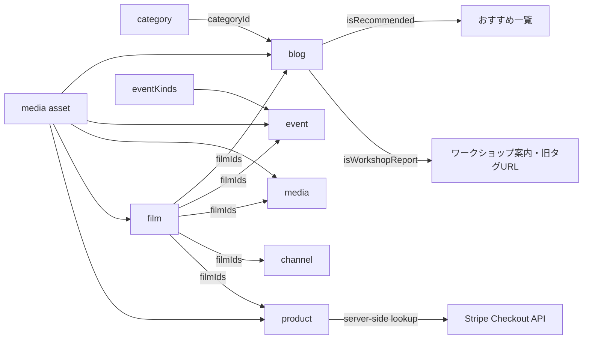

# 自作CMS Phase -1 コンテンツ監査

実施日: 2026-08-11  
対象: Astro実装、WordPress移行スナップショット、旧WordPressテーマ、ローカル画像・PDF、サーバーAPI

## この文書の位置付け

この文書は `custom-cms-migration-plan.md` のPhase -1で決めた、CMSの管理境界と初期MVPの範囲を記録する。

この監査では移行元を識別するためWordPress名の`media`と`channel`を使用する。Phase 1の正式なドメインモデルでは、実態に合わせてそれぞれ`pressCoverage`と`video`へ改名した。正式スキーマは`custom-cms-phase1-schema.md`を参照する。

運用上、コンテンツ編集、ショップ運用、サイトオーナー業務は1人のオーナーが担当する。開発者と自動実行される公開システムだけを分離して扱う。

| 運用ロール   | 責務                                                                 |
| ------------ | -------------------------------------------------------------------- |
| オーナー     | コンテンツ編集、ショップ運用、内容確認、反映待ちの確定、サイト更新   |
| 開発者       | 表示、入力規則、決済・問い合わせ、ナビゲーション、低頻度の固定ページ |
| 公開システム | スナップショット確定、検証、静的ビルド、デプロイ、公開予約の実行     |

頻度は `高`（月数回以上）、`中`（年数回）、`低`（年1回未満または制度変更時）とする。初回運用レビューで実績に合わせて見直す。

## 監査結果の要約

2026-08-10のWordPressスナップショットには、ブログ310件、ニュース245件、イベント234件、メディア22件、チャンネル21件がある。分類はカテゴリ5件、作品タグ9件、イベントタグ10件、廃止予定の汎用ブログタグ1,461件である。

コード側には作品9件、商品6件、ショップFAQ、監督プロフィール、ワークショップ案内、自主上映案内、高幡台73号棟の記録、法務・案内ページ、ナビゲーション、共通SEOがある。ローカル資産は画像356件、PDF46件、表計算ファイル1件、動画1件で、WordPress側には少なくともメディア記事添付PDF13件と本文中のメディア参照がある。

境界の結論は次の通り。

- 初期MVPで管理画面から編集するのは `news`、`blog`、`event`、`media`、`channel`。
- `category` はブログ編集に必要な管理対象だが、初期MVPでは独立した自由編集画面を作らず、管理された選択肢として扱う。
- `film`、`product`、`faq` は型付きJSONへ移すが、初期MVPでは管理画面から編集しない。
- 商品の販売可否、価格、価格区分、対応ディスク、送料規則はサーバー側でも同じ正本を読み、クライアント送信値を信用しない。
- 固定ページ、ナビゲーション、共通SEOは初期MVPではコードに残す。専用ページのデザインや業務ルールまでCMSへ移さない。
- 新規画像・PDFの管理画面はPhase 6で実装する。既存コンテンツから実際に参照されるメディアだけをR2へ移行する。

## コンテンツ台帳

### 構造化コンテンツと参照マスター

| 情報                      | 現在の正本・件数                           | 更新者           | 頻度 | 主な関連                                           | 現在の公開手順                      | 移行先            |
| ------------------------- | ------------------------------------------ | ---------------- | ---- | -------------------------------------------------- | ----------------------------------- | ----------------- |
| お知らせ `news`           | WordPress、245件                           | オーナー         | 高   | トップ、一覧                                       | WordPressで公開後、サイト更新を起動 | CMSで編集         |
| ブログ `blog`             | WordPress、310件                           | オーナー         | 高   | category、film、イベント、おすすめ、ワークショップ | WordPressで公開後、サイト更新を起動 | CMSで編集         |
| イベント `event`          | WordPress、234件                           | オーナー         | 高   | film、eventKinds                                   | WordPressで公開後、サイト更新を起動 | CMSで編集         |
| メディア `media`          | WordPress、22件                            | オーナー         | 中   | film、PDF、YouTube                                 | WordPressで公開後、サイト更新を起動 | CMSで編集         |
| チャンネル `channel`      | WordPress、21件                            | オーナー         | 中   | film、YouTube                                      | WordPressで公開後、サイト更新を起動 | CMSで編集         |
| ブログカテゴリ `category` | WordPress、5件。表示対象はコードにも列挙   | オーナー         | 低   | blog                                               | 投稿編集時に選択                    | CMS管理の選択肢   |
| イベント種別 `eventKinds` | WordPress、10件                            | オーナー         | 低   | event                                              | 投稿編集時に選択                    | CMS管理の選択肢   |
| 作品 `film`               | `astro/src/constants/film_info.ts`、9件    | 開発者           | 低   | blog、event、media、channel、product               | コード変更、レビュー、デプロイ      | JSON参照マスター  |
| 商品 `product`            | `astro/src/constants/products_dvd.ts`、6件 | オーナー＋開発者 | 低   | film、商品記事、画像、決済                         | コード変更、レビュー、デプロイ      | JSON参照マスター  |
| ショップFAQ `faq`         | `astro/src/pages/pafshop/faq/index.astro`  | オーナー＋開発者 | 低   | 自主上映、問い合わせ                               | コード変更、レビュー、デプロイ      | JSON参照マスター  |
| 汎用ブログタグ            | WordPress、1,461件                         | 移行後は更新なし | 廃止 | 旧タグURL                                          | WordPressで投稿へ付与               | 新CMSへ移行しない |

`category` と `eventKinds` は参照整合性のため安定IDを持たせる。初期MVPでは誤操作を避けるため、コンテンツ編集フォームで既存値を選択できるところまでとし、追加・改名・削除はJSON変更とレビューで行う。

### 固定コンテンツとサイト設定

| 情報                                 | 現在の場所                                                        | 更新者           | 頻度         | 分類と理由                                              |
| ------------------------------------ | ----------------------------------------------------------------- | ---------------- | ------------ | ------------------------------------------------------- |
| 監督プロフィール                     | `pages/director/index.astro`                                      | 開発者           | 低           | コードで固定。作品年表だけfilmから生成                  |
| ワークショップ案内・実績             | `pages/workshop/index.astro`                                      | 開発者           | 中           | 初期はコードで固定。需要が確認できたら固定ページCMSへ   |
| 自主上映案内                         | `pages/four-walling/index.astro`                                  | 開発者           | 低           | 料金・手順を含むためレビュー付きコード変更              |
| 高幡台73号棟の記録                   | `pages/takahatadai73/index.astro` と `constants/takahatadai73.ts` | 開発者           | 原則更新なし | 専用UIと史料群を含むアーカイブとしてコードで固定        |
| ショップ固有の記事ブロック           | `components/shop/article/*.astro`                                 | 開発者           | 低           | 商品JSONにない専用レイアウトなのでコードで固定          |
| トップの導線・紹介文                 | `pages/index.astro`                                               | 開発者           | 低           | レイアウトと一体のためコードで固定。最新newsのみCMS参照 |
| ナビゲーション                       | `components/AppNav.astro`                                         | 開発者           | 低           | 情報設計・ルーティングなのでコードで固定                |
| 共通SEO・SNSアカウント               | `constants/seo.ts`                                                | 開発者           | 低           | 初期はコードで固定。変更需要が増えたらsite settingsへ   |
| プライバシー・免責・個人情報・特商法 | 各Astroページと `PrivacyPolicy.astro`                             | オーナー＋開発者 | 制度変更時   | 法務レビューが必要なためコードで固定                    |
| 推奨環境、404、完了・エラーページ    | 各Astroページ                                                     | 開発者           | 低           | UI・システム状態の説明なのでコードで固定                |
| ページネーション件数、表示文言       | `constants/blog.ts`、`constants/pagination.ts` 等                 | 開発者           | 低           | 表示ルールなのでコードで固定                            |

ワークショップ案内は年数回の更新が想定されるためCMS候補ではあるが、初期MVPの投稿ワークフロー完成を優先して後続へ送る。監督プロフィール、共通SEO、法務ページも同じ「固定ページ」モデルへ将来統合できるが、初期MVPには含めない。

### 画像・PDF・動画

| 資産                         | 現在の場所                                                                   | 関連                     | 更新・公開                          | 移行判断                                                      |
| ---------------------------- | ---------------------------------------------------------------------------- | ------------------------ | ----------------------------------- | ------------------------------------------------------------- |
| WordPress本文内画像          | 本文HTML内の `/wp/wp-content/uploads/` 等                                    | blog、event、media、news | WordPressへのアップロードと記事公開 | オブジェクトストレージへ移行。本文URLを変換                   |
| WordPressメディアPDF         | `media_pdf_url`、13件                                                        | media                    | WordPress添付後に記事公開           | オブジェクトストレージへ移行しmediaからID参照                 |
| 作品画像                     | `src/assets/images/films/`                                                   | film                     | コード変更とデプロイ                | film JSONのメディア参照へ移し、ファイル自体はPhase 6で移行    |
| 商品画像                     | `src/assets/images/pafshop/`                                                 | product                  | コード変更とデプロイ                | product JSONのメディア参照へ移し、ファイル自体はPhase 6で移行 |
| ワークショップ・自主上映画像 | `src/assets/images/workshop/`、`four-walling/`                               | 固定ページ               | コード変更とデプロイ                | 固定ページ資産として維持                                      |
| 高幡台史料                   | `src/assets/images/takahatadai73/`、`public/assets/documents/takahatadai73/` | 高幡台専用ページ         | 原則更新なし                        | アーカイブ資産として現状維持                                  |
| YouTube                      | WordPressフィールドまたはfilm定数の動画ID                                    | channel、media、film     | 参照IDを更新して公開                | JSONには動画IDまたは正規URLを保存                             |
| トップ動画・共通OG画像       | `public/assets/video/`、`public/assets/images/`                              | サイト設定               | コード変更とデプロイ                | 初期はコードで固定                                            |

メディアファイルにはコンテンツから独立した不変ID、保存キー、MIME type、サイズ、代替テキスト、作成日時を持たせる。JSONへbase64データは埋め込まない。

2026-08-11に、WordPress移行スナップショットの全フィールドから `/wp/wp-content/uploads/` の参照URLを抽出した。保存キー単位で5,935ファイル、URL表記6,073種類、参照6,154回、取得可能5,926ファイル、合計約1.91 GiBだった。欠損候補9件のうち8件は元サイズ画像から復旧でき、1件は復旧候補がない。WordPressメディアライブラリの未使用ファイルは移行対象に含めない。

公開メディアと公開スナップショットはR2を正本とし、B2へ自動複製する。外付けSSDにも初回移行時と半年ごと、大規模変更前後に保存する。オーナーには月1回、CMSデータの圧縮JSON、台帳、照合結果をメールし、障害時は月次を待たず通知する。

## コンテンツ間の関連

関連は表示名ではなく安定IDで保存する。WordPressの `film_tags` はfilm IDへ、カテゴリとイベント種別もそれぞれのIDへ正規化する。表示順が意味を持つ配列は入力順を保持する。

## ページとコンテンツの対応

| 公開ページ                                 | 使用コンテンツ             | 備考                                            |
| ------------------------------------------ | -------------------------- | ----------------------------------------------- |
| `/`                                        | 最新news、固定コンテンツ   | トップの本文・導線はコード                      |
| `/news/`、`/news/page/[page]/`             | news                       | 一覧内に本文も表示                              |
| `/[pageName]/`                             | blog                       | 既存slugをルート直下で維持                      |
| `/blog/`、`/blog/page/[page]/`             | blog                       | 全件一覧                                        |
| `/blog/[categoryName]/...`                 | blog、category             | categoryIdから公開slugを解決                    |
| `/blog/recommended/...`                    | blog                       | `isRecommended` で抽出                          |
| `/blog/tag/映像ワークショップレポート/...` | blog                       | `isWorkshopReport` で抽出する互換URL            |
| `/workshop/`                               | 固定ページ、blog           | 最近のレポート5件だけblogから取得               |
| `/events/`、`/events/archive/[year]/`      | event                      | 日付による現行・年別一覧                        |
| `/events/[id]/`                            | event                      | URL互換のため当面legacyIdを使用                 |
| `/media/`、`/media/[id]/`                  | media                      | 詳細はPDF・YouTubeを含む                        |
| `/channel/`、`/channel/[id]/`              | channel                    | YouTubeサムネイルと動画を含む                   |
| `/films/`、`/films/[id]/`                  | film                       | film IDをURLに使用                              |
| `/director/`                               | 固定プロフィール、film     | 作品年表をfilmから生成                          |
| `/pafshop/`、`/pafshop/[name]/`            | product、film、固定記事    | 商品slugは既存nameを維持                        |
| `/pafshop/faq/`                            | faq                        | 初期はJSON参照マスター                          |
| `/pafshop/cart/`                           | product、カート状態        | 表示価格はproductから開始するが最終価格ではない |
| `/four-walling/`                           | 固定コンテンツ             | filmへの導線あり                                |
| `/takahatadai73/`                          | 専用固定データ・史料、film | 通常CMSの対象外                                 |
| その他の案内・法務・状態ページ             | 固定コンテンツ             | コードで固定                                    |

## 公開手順

### 現行本番

WordPressコンテンツは、WordPressで編集・公開した後、管理メニューの「サイト更新」からGitHub Actionsを起動して静的サイトへ反映する。コード内コンテンツはPull Requestをマージし、付与ラベルに応じたGitHub Actionsで公開する。二重起動を避け、前回ワークフローの完了を確認する必要がある。

Astro移行ブランチでは `pnpm export:wordpress` でスナップショットを更新し、`pnpm build` で静的生成する暫定状態である。

### 自作CMS初期MVP

1. オーナーが作成・編集し、下書き保存する。下書き保存ではビルドしない。
2. プレビューは編集中revisionを使い、本番公開データと分離する。
3. 記事単位の操作で編集中revisionを「反映待ち」にする。この時点ではビルドしない。
4. ダッシュボードの反映待ち一覧を確認し、「サイト更新」で全反映待ちをまとめる。
5. 公開システムがスキーマ検証後に公開スナップショットを確定し、Astro全ビルドとデプロイを1回要求する。
6. 成功時だけ各記事の公開済みrevisionを更新し、失敗時は直前の正常デプロイを維持する。

各記事の編集画面には公開済みrevisionと編集中revisionを表示する。反映待ちにした後で再編集した場合は、意図しない公開を避けるため下書きへ戻す。公開予約は同じスナップショット・ビルド経路を使うが、実行基盤はPhase 8で追加する。

JSON参照マスターとコード固定コンテンツはPull Requestで変更し、テスト、レビュー、デプロイを通す。MVP期間中にCMS編集とコード変更が同時に発生した場合も、ビルドが読むスナップショットのバージョンを記録できるようにする。

## サーバー側処理に影響するデータ

| データ                       | 現在の利用箇所                                       | 必要な扱い                                           |
| ---------------------------- | ---------------------------------------------------- | ---------------------------------------------------- |
| 商品slug、商品名             | 商品ページ、カート、Checkout明細                     | サーバー正本から解決し、未知の商品を拒否             |
| 価格区分、対応ディスク、単価 | 商品ページ、`parseCheckoutPayload`、Stripe line item | クライアントの単価を無視し、サーバー正本で再計算     |
| 販売可否                     | 現状は明示フィールドなし                             | productへ追加し、非販売商品をAPIでも拒否             |
| 送料                         | `subtotal >= 3000 ? 0 : 300`                         | 商品JSONではなく業務ルールとしてサーバーコードに残す |
| 購入数量上限                 | Checkout APIで1商品1〜10、全20明細まで               | 入力検証ルールとしてサーバーコードに残す             |
| 配送可能国、決済手段         | Stripe Checkout API                                  | 業務・決済設定としてサーバーコードに残す             |
| 成功・キャンセルURL          | Stripe Checkout API                                  | ルーティング設定としてコードに残す                   |
| 問い合わせ宛先・送信元       | Vercel環境変数                                       | CMSへ置かず秘密・環境設定として管理                  |
| SEO用価格・在庫表現          | 商品詳細のJSON-LD                                    | product正本から生成し、決済正本と不一致を検査        |

product JSONは公開表示用コピーを生成してよいが、Checkout APIも同一バージョンの非公開または署名・検証済み正本を読み込む。管理画面から商品編集を可能にするまでは、オーナーと開発者のレビューを必須とする。

## 初期MVPの確定範囲

### 含める

- `news`、`blog`、`event`、`media`、`channel` の移行、検索、作成、編集、下書き、プレビュー、反映待ち、公開停止
- 公開済みrevisionと編集中revisionの表示
- 反映待ち一覧と、まとめて実行する「サイト更新」
- category、eventKinds、filmを使った型付き関連選択
- おすすめ、ワークショップレポートのboolean入力
- 公開スナップショット、スキーマ検証、Astro全ビルド要求
- WordPress由来HTMLと既存メディア参照の読み込み
- `film`、`product`、`faq` のJSON参照マスター化
- productをサーバー側正本として使うCheckout検証

### 後続フェーズへ送る

- 画像・PDFのアップロード、選択、削除UIはPhase 6
- 公開予約の実行基盤はPhase 8。ただしスキーマには `scheduled` と `publishedAt` を先に持たせる
- film、product、faq、category、eventKindsの独立した管理画面
- 監督プロフィール、ワークショップ、自主上映、共通SEO、ナビゲーション、法務ページの固定ページCMS
- 高幡台73号棟の専用アーカイブ編集
- 汎用タグ、差分HTML生成、ISR、共同編集、複雑な承認フロー

## Phase 1への入力

Phase 1では、この境界を前提に次を確定する。

- 5つの編集対象、3つのJSON参照マスター、category、eventKinds、media assetのスキーマ
- 公開slugとは独立した不変IDと、既存URL用legacyIdの規則
- film tag 9件とfilm ID 9件の明示的な対応表
- productの `isAvailable` と、サーバーが読み込む正本のバージョン規則
- 本文HTML内の画像・内部リンクと、media PDF 13件の移行表現
- 固定ページを将来CMS化するときに追加できる `page` / `siteSettings` 境界

## 監査根拠

- `astro/data/wordpress-export.json`
- `astro/scripts/export-wordpress.mjs`
- `astro/src/lib/wp-api.ts`
- `astro/src/constants/film_info.ts`
- `astro/src/constants/products_dvd.ts`
- `astro/src/constants/takahatadai73.ts`
- `astro/src/pages/` と `astro/src/components/`
- `astro/api/stripe/checkout.ts` と `astro/src/lib/checkout.ts`
- `html/wp/wp-content/themes/petiteadventurefilms/api/`
- ルート `README.md` の公開手順
